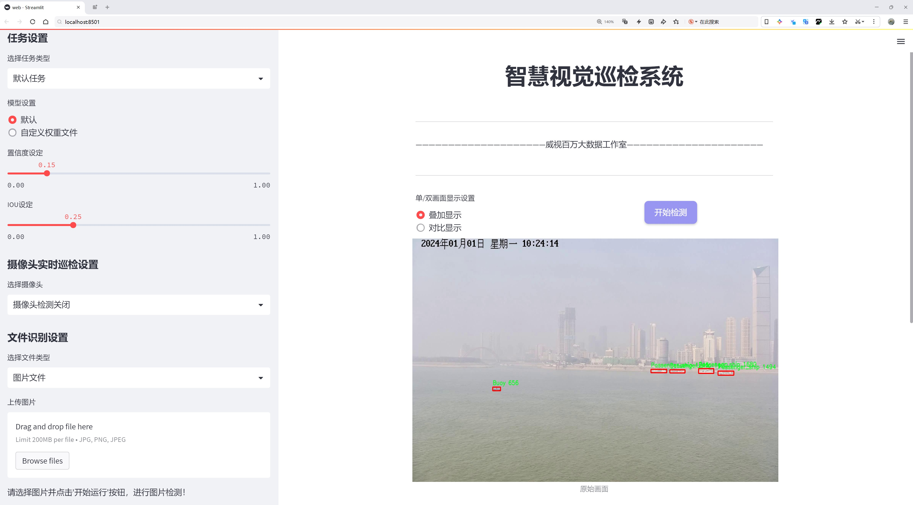
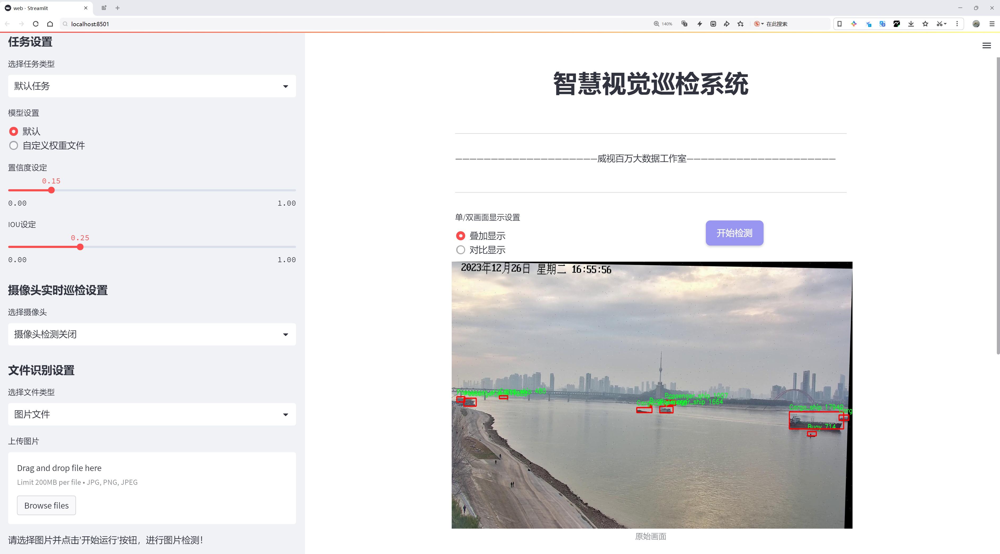
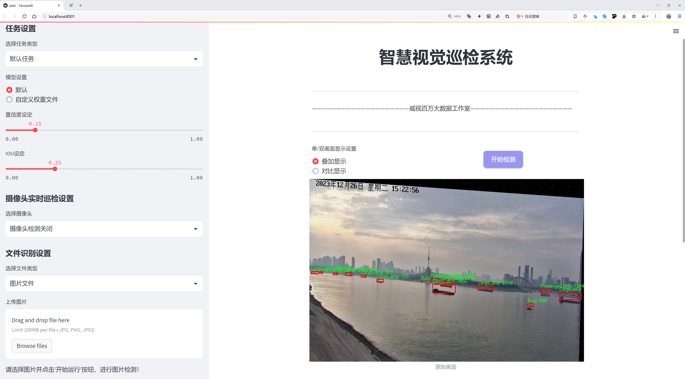
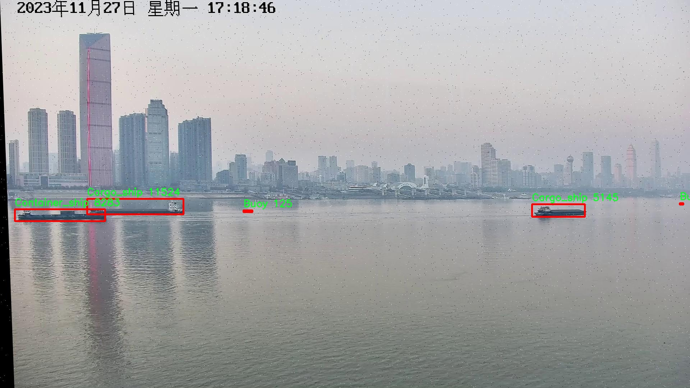
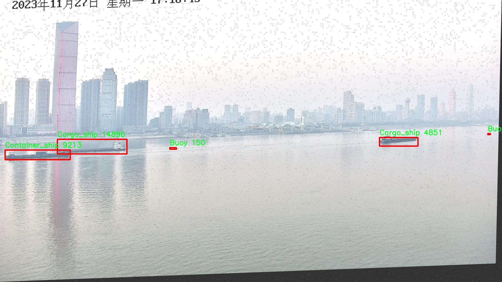
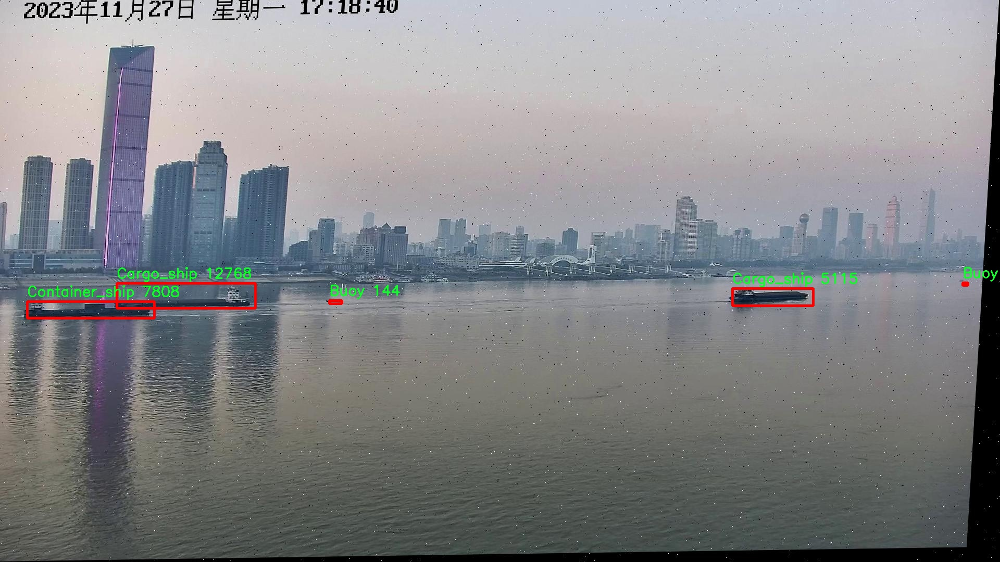
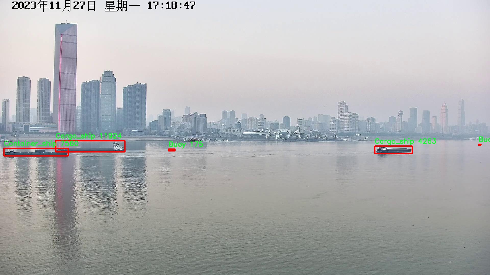
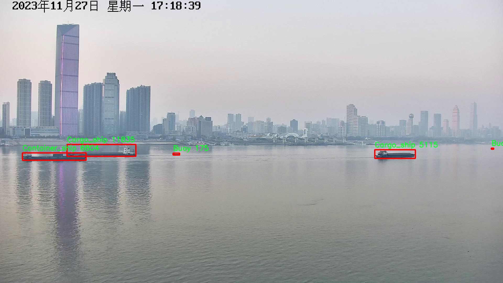

# 江上场景目标检测检测系统源码分享
 # [一条龙教学YOLOV8标注好的数据集一键训练_70+全套改进创新点发刊_Web前端展示]

### 1.研究背景与意义

项目参考[AAAI Association for the Advancement of Artificial Intelligence](https://gitee.com/qunmasj/projects)

项目来源[AACV Association for the Advancement of Computer Vision](https://kdocs.cn/l/cszuIiCKVNis)

研究背景与意义

随着全球航运业的快速发展，江上交通的安全与效率愈发受到重视。江上场景的目标检测不仅涉及到船舶的监控与管理，还关系到水上交通的安全、环境保护及资源的合理利用。近年来，计算机视觉技术的飞速进步为这一领域提供了新的解决方案，尤其是深度学习技术的应用，使得目标检测的准确性和实时性得到了显著提升。在众多目标检测算法中，YOLO（You Only Look Once）系列模型因其高效性和准确性而受到广泛关注。YOLOv8作为该系列的最新版本，具备了更强的特征提取能力和更快的推理速度，成为研究江上场景目标检测的理想选择。

本研究旨在基于改进的YOLOv8模型，构建一个高效的江上场景目标检测系统。该系统将专注于对江面上四类目标的检测，包括浮标、货船、集装箱船和客船。数据集的构建是实现这一目标的基础。本研究所使用的数据集包含2200幅图像，涵盖了上述四类目标，具备较高的多样性和代表性。这些图像不仅包括不同类型的船舶，还涵盖了不同的天气、光照和水面条件，能够有效地模拟实际应用中的复杂场景。这一数据集的构建，为模型的训练和测试提供了坚实的基础。

改进YOLOv8模型的必要性在于，传统的YOLO模型在复杂背景下的目标检测性能仍有待提升。江上场景中，水面波动、光线反射以及船舶的多样性都会对目标检测造成挑战。因此，针对这些特定问题，研究将通过引入新的数据增强技术、优化网络结构以及调整损失函数等方式，提升模型在江上场景中的检测精度和鲁棒性。通过这些改进，期望能够实现对目标的高效、准确检测，从而为江上交通的智能化管理提供技术支持。

本研究的意义不仅在于提升江上场景目标检测的技术水平，更在于为水上交通安全管理提供实用的解决方案。随着江上交通流量的增加，传统的人工监控方式已难以满足实际需求，而基于深度学习的自动化检测系统将大大提高监控效率，降低人为失误的风险。此外，该系统的成功应用还将为其他领域的目标检测提供借鉴，推动计算机视觉技术在更广泛场景中的应用。

综上所述，基于改进YOLOv8的江上场景目标检测系统的研究，不仅具有重要的学术价值，也具备广泛的应用前景。通过对目标检测技术的深入探索，期望能够为江上交通的安全管理、环境保护及资源利用提供有力的技术支持，推动相关领域的可持续发展。

### 2.图片演示







##### 注意：由于此博客编辑较早，上面“2.图片演示”和“3.视频演示”展示的系统图片或者视频可能为老版本，新版本在老版本的基础上升级如下：（实际效果以升级的新版本为准）

  （1）适配了YOLOV8的“目标检测”模型和“实例分割”模型，通过加载相应的权重（.pt）文件即可自适应加载模型。

  （2）支持“图片识别”、“视频识别”、“摄像头实时识别”三种识别模式。

  （3）支持“图片识别”、“视频识别”、“摄像头实时识别”三种识别结果保存导出，解决手动导出（容易卡顿出现爆内存）存在的问题，识别完自动保存结果并导出到tempDir中。

  （4）支持Web前端系统中的标题、背景图等自定义修改，后面提供修改教程。

  另外本项目提供训练的数据集和训练教程,暂不提供权重文件（best.pt）,需要您按照教程进行训练后实现图片演示和Web前端界面演示的效果。

### 3.视频演示

[3.1 视频演示](https://www.bilibili.com/video/BV1fNtQeBEpc/)

### 4.数据集信息展示

##### 4.1 本项目数据集详细数据（类别数＆类别名）

nc: 4
names: ['Buoy', 'Cargo_ship', 'Container_ship', 'Passenger_ship']


##### 4.2 本项目数据集信息介绍

数据集信息展示

在本研究中，我们使用了名为“ocean”的数据集，以改进YOLOv8在江上场景中的目标检测系统。该数据集专注于水域环境中的特定目标，旨在提高模型在复杂背景下的检测精度和鲁棒性。数据集包含四个主要类别，分别是“Buoy”（浮标）、“Cargo_ship”（货船）、“Container_ship”（集装箱船）和“Passenger_ship”（客船）。这些类别的选择不仅反映了江上常见的目标类型，也为模型提供了多样化的训练样本，以应对不同的检测挑战。

“ocean”数据集的构建过程涉及对江上场景的广泛采集，确保涵盖各种天气条件、光照变化以及不同时间段的场景。这种多样性使得数据集在训练过程中能够有效地模拟真实世界中的复杂情况，从而提升模型的泛化能力。每个类别的样本均经过精心标注，确保在训练过程中，YOLOv8能够准确识别和分类这些目标。标注过程不仅包括目标的边界框定位，还涉及到对目标的特征描述，以便模型在学习过程中能够抓住关键特征。

在数据集的设计中，我们特别考虑了目标的大小、形状和颜色等因素。例如，浮标通常较小且颜色鲜艳，易于在水面上被识别；而货船和集装箱船则相对较大，形状多样，可能会与周围环境产生一定的混淆。因此，在数据集中，浮标、货船、集装箱船和客船的样本数量经过合理分配，以确保模型在训练时能够接触到足够的样本，从而提高对每一类别的识别能力。

此外，数据集还包含了不同角度和距离下的目标图像，这为模型的训练提供了更为全面的视角。通过引入不同的拍摄角度和距离，模型能够学习到目标在不同条件下的外观变化，从而增强其在实际应用中的适应性。例如，客船在远处可能与水面背景融为一体，而在近距离观察时则显得格外明显。这样的设计使得“ocean”数据集不仅是一个简单的图像集合，更是一个经过深思熟虑的训练资源，旨在推动目标检测技术的发展。

在进行YOLOv8的训练时，我们将“ocean”数据集划分为训练集和验证集，以便在训练过程中监控模型的性能并进行必要的调整。通过不断迭代和优化，我们期望最终能够实现对江上场景中目标的高效检测，提升模型在实际应用中的表现。综上所述，“ocean”数据集的构建和应用为本研究提供了坚实的基础，推动了江上场景目标检测系统的进步。











### 5.全套项目环境部署视频教程（零基础手把手教学）

[5.1 环境部署教程链接（零基础手把手教学）](https://www.ixigua.com/7404473917358506534?logTag=c807d0cbc21c0ef59de5)


[5.2 安装Python虚拟环境创建和依赖库安装视频教程链接（零基础手把手教学）](https://www.ixigua.com/7404474678003106304?logTag=1f1041108cd1f708b01a)

### 6.手把手YOLOV8训练视频教程（零基础小白有手就能学会）

[6.1 手把手YOLOV8训练视频教程（零基础小白有手就能学会）](https://www.ixigua.com/7404477157818401292?logTag=d31a2dfd1983c9668658)

### 7.70+种全套YOLOV8创新点代码加载调参视频教程（一键加载写好的改进模型的配置文件）

[7.1 70+种全套YOLOV8创新点代码加载调参视频教程（一键加载写好的改进模型的配置文件）](https://www.ixigua.com/7404478314661806627?logTag=29066f8288e3f4eea3a4)

### 8.70+种全套YOLOV8创新点原理讲解（非科班也可以轻松写刊发刊，V10版本正在科研待更新）

由于篇幅限制，每个创新点的具体原理讲解就不一一展开，具体见下列网址中的创新点对应子项目的技术原理博客网址【Blog】：


[8.1 70+种全套YOLOV8创新点原理讲解链接](https://gitee.com/qunmasj/good)

### 9.系统功能展示（检测对象为举例，实际内容以本项目数据集为准）

图9.1.系统支持检测结果表格显示

  图9.2.系统支持置信度和IOU阈值手动调节

  图9.3.系统支持自定义加载权重文件best.pt(需要你通过步骤5中训练获得)

  图9.4.系统支持摄像头实时识别

  图9.5.系统支持图片识别

  图9.6.系统支持视频识别

  图9.7.系统支持识别结果文件自动保存

  图9.8.系统支持Excel导出检测结果数据


### 10.原始YOLOV8算法原理

原始YOLOv8算法原理

YOLOv8算法是由Glenn-Jocher提出的，作为YOLO系列的最新版本，它在YOLOv3和YOLOv5的基础上进行了多项重要改进。YOLOv8的设计理念是通过增强特征提取能力和优化模型结构，来实现更高的检测精度和更快的推理速度。其核心原理体现在数据预处理、骨干网络结构、特征融合机制、检测头设计以及标签分配策略等多个方面。

首先，在数据预处理阶段，YOLOv8继承了YOLOv5的增强策略，采用了马赛克增强、混合增强、空间扰动和颜色扰动等多种手段。这些数据增强技术不仅丰富了训练数据的多样性，还有效提高了模型的鲁棒性。马赛克增强通过将多张图像拼接在一起，模拟了不同场景下的物体出现情况；混合增强则通过对两张图像进行混合，进一步增加了样本的多样性。空间扰动和颜色扰动则通过随机变换图像的空间位置和颜色特征，帮助模型更好地适应不同的环境和光照条件。

接下来，YOLOv8的骨干网络结构在YOLOv5的基础上进行了优化。YOLOv5的主干网络采用了层次分明的设计，每使用一层步长为2的3×3卷积进行特征图的降采样后，接入C3模块以增强特征表达能力。YOLOv8则将C3模块替换为新的C2f模块，C2f模块通过引入更多的分支，丰富了梯度回传过程中的信息流动。这种设计不仅提高了特征提取的效率，还使得网络在处理复杂场景时能够更好地捕捉到细节信息。

在特征融合方面，YOLOv8依然采用了FPN（特征金字塔网络）和PAN（路径聚合网络）的结构，以实现多尺度信息的充分融合。通过这种结构，YOLOv8能够有效地整合来自不同层次的特征，增强模型对小物体和大物体的检测能力。尽管C3模块被替换为C2f模块，但整体的FPN-PAN结构保持了YOLOv5的设计理念，确保了特征融合的高效性和准确性。

YOLOv8在检测头的设计上也进行了重要的创新。与YOLOv3和YOLOv5的耦合检测头不同，YOLOv8采用了解耦头结构。该结构通过设置两条并行分支，分别提取类别特征和位置特征，使得分类和定位任务可以独立进行。这种解耦设计不仅提高了模型的灵活性，还使得网络在处理复杂场景时能够更好地平衡分类和定位的性能。

在标签分配策略方面，YOLOv8摒弃了YOLOv5中依赖于数据集的候选框聚类方法，转而采用了TOOD（Task-Oriented Object Detection）策略。这种动态标签分配策略通过直接使用目标边界框和目标分数，简化了正负样本的匹配过程。YOLOv8的损失函数主要由类别损失和位置损失组成，其中类别损失采用了VFL（Varifocal Loss），而位置损失则结合了CIoU（Complete Intersection over Union）和DFL（Distribution Focal Loss）。VFL通过不对称参数对正负样本进行加权，确保了高质量正样本对损失的贡献更大，从而提升了模型的检测精度。

YOLOv8的整体网络结构由骨干网络、颈部结构和检测头三部分组成。骨干网络负责特征提取，颈部结构实现特征融合，而检测头则负责输出检测信息。通过这种模块化设计，YOLOv8不仅具备了更快的推理速度和更高的精度，还在训练和调整上更加便捷，适应了不同硬件环境的需求。

总的来说，YOLOv8算法在多个方面进行了创新和优化，使其在目标检测领域中表现出色。其高效的特征提取能力、灵活的网络结构和先进的损失函数设计，使得YOLOv8成为当前业界最流行和成功的目标检测算法之一。随着YOLOv8的广泛应用，其在各类实际场景中的表现也将进一步推动目标检测技术的发展。


### 11.项目核心源码讲解（再也不用担心看不懂代码逻辑）

#### 11.1 70+种YOLOv8算法改进源码大全和调试加载训练教程（非必要）\ultralytics\models\yolo\segment\predict.py

以下是对代码的核心部分进行提炼和详细注释的结果：

```python
# 导入必要的模块和类
from ultralytics.engine.results import Results
from ultralytics.models.yolo.detect.predict import DetectionPredictor
from ultralytics.utils import DEFAULT_CFG, ops

class SegmentationPredictor(DetectionPredictor):
    """
    SegmentationPredictor类，继承自DetectionPredictor类，用于基于分割模型的预测。
    """

    def __init__(self, cfg=DEFAULT_CFG, overrides=None, _callbacks=None):
        """初始化SegmentationPredictor，设置配置、覆盖参数和回调函数。"""
        super().__init__(cfg, overrides, _callbacks)  # 调用父类构造函数
        self.args.task = 'segment'  # 设置任务类型为分割

    def postprocess(self, preds, img, orig_imgs):
        """对每个输入图像批次的预测结果进行后处理，包括非极大值抑制和掩膜处理。"""
        # 应用非极大值抑制，过滤掉低置信度的检测框
        p = ops.non_max_suppression(preds[0],
                                     self.args.conf,  # 置信度阈值
                                     self.args.iou,   # IOU阈值
                                     agnostic=self.args.agnostic_nms,  # 是否类别无关的NMS
                                     max_det=self.args.max_det,  # 最大检测框数量
                                     nc=len(self.model.names),  # 类别数量
                                     classes=self.args.classes)  # 选择的类别

        # 如果输入图像不是列表，转换为numpy数组
        if not isinstance(orig_imgs, list):
            orig_imgs = ops.convert_torch2numpy_batch(orig_imgs)

        results = []  # 存储处理后的结果
        # 处理预测结果的第二个输出
        proto = preds[1][-1] if len(preds[1]) == 3 else preds[1]  # 处理模型输出

        # 遍历每个预测结果
        for i, pred in enumerate(p):
            orig_img = orig_imgs[i]  # 获取原始图像
            img_path = self.batch[0][i]  # 获取图像路径
            
            if not len(pred):  # 如果没有检测到目标
                masks = None  # 掩膜设置为None
            elif self.args.retina_masks:  # 如果使用Retina掩膜
                # 将检测框缩放到原始图像大小
                pred[:, :4] = ops.scale_boxes(img.shape[2:], pred[:, :4], orig_img.shape)
                # 处理掩膜
                masks = ops.process_mask_native(proto[i], pred[:, 6:], pred[:, :4], orig_img.shape[:2])  # HWC
            else:  # 否则使用普通掩膜处理
                masks = ops.process_mask(proto[i], pred[:, 6:], pred[:, :4], img.shape[2:], upsample=True)  # HWC
                # 缩放检测框
                pred[:, :4] = ops.scale_boxes(img.shape[2:], pred[:, :4], orig_img.shape)

            # 将结果添加到结果列表中
            results.append(Results(orig_img, path=img_path, names=self.model.names, boxes=pred[:, :6], masks=masks))
        
        return results  # 返回处理后的结果
```

### 代码核心部分说明：
1. **类定义**：`SegmentationPredictor`类用于实现基于分割模型的预测，继承自`DetectionPredictor`。
2. **初始化方法**：构造函数中调用父类的构造函数，并设置任务类型为分割。
3. **后处理方法**：`postprocess`方法对模型的预测结果进行后处理，包括：
   - 应用非极大值抑制（NMS）来过滤低置信度的检测框。
   - 处理输入图像的格式，将其转换为numpy数组。
   - 遍历每个预测结果，处理掩膜并将结果存储在列表中。
4. **结果返回**：最终返回处理后的结果列表，包含原始图像、路径、类别名称、检测框和掩膜。

该文件是一个用于YOLOv8分割模型预测的Python脚本，主要定义了一个名为`SegmentationPredictor`的类，该类继承自`DetectionPredictor`类，专门用于处理图像分割任务。首先，文件开头的注释部分提到该项目是Ultralytics YOLO的实现，并遵循AGPL-3.0许可证。

在类的定义中，`SegmentationPredictor`类的构造函数`__init__`接收三个参数：`cfg`（配置），`overrides`（覆盖配置），和`_callbacks`（回调函数）。构造函数首先调用父类的构造函数，并将任务类型设置为“segment”，表示该预测器将用于图像分割。

接下来的`postprocess`方法用于对模型的预测结果进行后处理。该方法接收三个参数：`preds`（模型的预测结果），`img`（输入图像），和`orig_imgs`（原始图像）。在该方法中，首先调用`ops.non_max_suppression`函数对预测结果进行非极大值抑制，过滤掉低置信度的检测框，并根据IOU（交并比）进行处理。

接着，代码检查输入的原始图像是否为列表格式，如果不是，则将其转换为NumPy数组格式。然后，方法准备处理每个预测结果。根据预测结果的数量，决定如何处理掩膜（masks）。如果没有检测到目标，掩膜设置为`None`；如果启用了`retina_masks`选项，则使用`ops.process_mask_native`函数处理掩膜；否则，使用`ops.process_mask`函数进行处理，并对检测框进行缩放，以适应原始图像的尺寸。

最后，处理后的结果被封装在`Results`对象中，并添加到结果列表中。该列表最终返回，包含了每个原始图像的预测结果，包括图像、路径、类别名称、检测框和掩膜。

总体而言，该文件实现了YOLOv8分割模型的预测功能，提供了必要的后处理步骤，以便将模型的输出转换为可用的结果。

#### 11.2 ui.py

```python
import sys
import subprocess

def run_script(script_path):
    """
    使用当前 Python 环境运行指定的脚本。

    Args:
        script_path (str): 要运行的脚本路径

    Returns:
        None
    """
    # 获取当前 Python 解释器的路径
    python_path = sys.executable

    # 构建运行命令，使用 streamlit 运行指定的脚本
    command = f'"{python_path}" -m streamlit run "{script_path}"'

    # 执行命令
    result = subprocess.run(command, shell=True)
    # 检查命令执行结果，如果返回码不为0，表示出错
    if result.returncode != 0:
        print("脚本运行出错。")

# 主程序入口
if __name__ == "__main__":
    # 指定要运行的脚本路径
    script_path = "web.py"  # 假设脚本在当前目录下

    # 调用函数运行脚本
    run_script(script_path)
```

### 代码注释说明：
1. **导入模块**：
   - `sys`：用于获取当前 Python 解释器的路径。
   - `subprocess`：用于执行外部命令。

2. **定义 `run_script` 函数**：
   - 该函数接受一个参数 `script_path`，表示要运行的 Python 脚本的路径。
   - 使用 `sys.executable` 获取当前 Python 解释器的路径，以便在命令中调用。
   - 构建命令字符串，使用 `streamlit` 模块运行指定的脚本。
   - 使用 `subprocess.run` 执行构建的命令，并通过 `shell=True` 允许在 shell 中执行。
   - 检查命令的返回码，如果不为0，打印错误信息。

3. **主程序入口**：
   - 在 `if __name__ == "__main__":` 块中，指定要运行的脚本路径（这里假设为 `web.py`）。
   - 调用 `run_script` 函数来执行指定的脚本。

这个程序文件名为 `ui.py`，主要功能是通过当前的 Python 环境运行一个指定的脚本。程序首先导入了必要的模块，包括 `sys`、`os` 和 `subprocess`，以及一个自定义的路径处理模块 `abs_path`。

在 `run_script` 函数中，首先获取当前 Python 解释器的路径，这样可以确保在正确的环境中运行脚本。接着，构建一个命令字符串，使用 `streamlit` 模块来运行指定的脚本。这里的 `script_path` 参数是要运行的脚本的路径。

然后，使用 `subprocess.run` 方法执行构建好的命令。这个方法会在一个新的进程中运行命令，并等待其完成。如果脚本运行过程中出现错误，返回的状态码不为零，程序会打印出“脚本运行出错”的提示信息。

在文件的最后部分，程序通过 `if __name__ == "__main__":` 语句来判断是否是直接运行该脚本。如果是，它会调用 `abs_path` 函数获取 `web.py` 脚本的绝对路径，并将其传递给 `run_script` 函数以执行该脚本。

整体来看，这个程序的设计旨在简化在特定 Python 环境中运行 Streamlit 应用的过程。

#### 11.3 70+种YOLOv8算法改进源码大全和调试加载训练教程（非必要）\ultralytics\utils\callbacks\mlflow.py

以下是经过简化和注释的核心代码部分：

```python
# 导入必要的库和模块
from ultralytics.utils import LOGGER, RUNS_DIR, SETTINGS, TESTS_RUNNING, colorstr

try:
    import os
    import mlflow  # 导入mlflow库用于日志记录

    # 确保在非测试环境下运行，并且mlflow集成已启用
    assert not TESTS_RUNNING or 'test_mlflow' in os.environ.get('PYTEST_CURRENT_TEST', '')
    assert SETTINGS['mlflow'] is True  # 验证mlflow集成是否启用

    # 检查mlflow库的版本
    assert hasattr(mlflow, '__version__')  
    from pathlib import Path
    PREFIX = colorstr('MLflow: ')  # 设置日志前缀

except (ImportError, AssertionError):
    mlflow = None  # 如果导入失败，mlflow设置为None


def on_pretrain_routine_end(trainer):
    """
    在预训练例程结束时记录训练参数到MLflow。

    参数:
        trainer (ultralytics.engine.trainer.BaseTrainer): 包含要记录的参数的训练对象。

    全局变量:
        mlflow: 用于记录的mlflow模块。

    环境变量:
        MLFLOW_TRACKING_URI: MLflow跟踪的URI。如果未设置，默认为'runs/mlflow'。
        MLFLOW_EXPERIMENT_NAME: MLflow实验的名称。如果未设置，默认为trainer.args.project。
        MLFLOW_RUN: MLflow运行的名称。如果未设置，默认为trainer.args.name。
    """
    global mlflow

    # 获取跟踪URI，默认为'runs/mlflow'
    uri = os.environ.get('MLFLOW_TRACKING_URI') or str(RUNS_DIR / 'mlflow')
    LOGGER.debug(f'{PREFIX} tracking uri: {uri}')
    mlflow.set_tracking_uri(uri)  # 设置跟踪URI

    # 设置实验和运行名称
    experiment_name = os.environ.get('MLFLOW_EXPERIMENT_NAME') or trainer.args.project or '/Shared/YOLOv8'
    run_name = os.environ.get('MLFLOW_RUN') or trainer.args.name
    mlflow.set_experiment(experiment_name)  # 设置实验

    mlflow.autolog()  # 自动记录参数和指标
    try:
        # 开始一个新的运行或获取当前活动的运行
        active_run = mlflow.active_run() or mlflow.start_run(run_name=run_name)
        LOGGER.info(f'{PREFIX}logging run_id({active_run.info.run_id}) to {uri}')
        
        # 提供查看日志的本地服务器地址
        if Path(uri).is_dir():
            LOGGER.info(f"{PREFIX}view at http://127.0.0.1:5000 with 'mlflow server --backend-store-uri {uri}'")
        
        # 记录训练参数
        mlflow.log_params(dict(trainer.args))
    except Exception as e:
        LOGGER.warning(f'{PREFIX}WARNING ⚠️ Failed to initialize: {e}\n'
                       f'{PREFIX}WARNING ⚠️ Not tracking this run')


def on_fit_epoch_end(trainer):
    """在每个训练周期结束时记录训练指标到MLflow。"""
    if mlflow:
        # 清理指标名称并记录到MLflow
        sanitized_metrics = {k.replace('(', '').replace(')', ''): float(v) for k, v in trainer.metrics.items()}
        mlflow.log_metrics(metrics=sanitized_metrics, step=trainer.epoch)


def on_train_end(trainer):
    """在训练结束时记录模型工件。"""
    if mlflow:
        # 记录最佳模型和其他文件
        mlflow.log_artifact(str(trainer.best.parent))  # 记录最佳模型目录
        for f in trainer.save_dir.glob('*'):  # 记录保存目录中的所有文件
            if f.suffix in {'.png', '.jpg', '.csv', '.pt', '.yaml'}:
                mlflow.log_artifact(str(f))

        mlflow.end_run()  # 结束当前运行
        LOGGER.info(f'{PREFIX}results logged to {mlflow.get_tracking_uri()}\n'
                    f"{PREFIX}disable with 'yolo settings mlflow=False'")


# 定义回调函数字典
callbacks = {
    'on_pretrain_routine_end': on_pretrain_routine_end,
    'on_fit_epoch_end': on_fit_epoch_end,
    'on_train_end': on_train_end} if mlflow else {}
```

### 代码说明：
1. **导入模块**：导入必要的库和模块，包括`mlflow`用于日志记录。
2. **环境检查**：确保在非测试环境下运行，并验证`mlflow`集成是否启用。
3. **`on_pretrain_routine_end`函数**：在预训练结束时记录训练参数，设置跟踪URI、实验名称和运行名称，并开始MLflow运行。
4. **`on_fit_epoch_end`函数**：在每个训练周期结束时记录训练指标。
5. **`on_train_end`函数**：在训练结束时记录模型工件（如最佳模型和其他文件）。
6. **回调函数字典**：根据是否成功导入`mlflow`来定义回调函数。

这个程序文件是用于Ultralytics YOLO模型的MLflow日志记录模块。MLflow是一个开源平台，用于管理机器学习生命周期，包括实验跟踪、模型管理和部署等功能。该模块的主要功能是记录训练过程中的参数、指标和模型工件，以便后续分析和复现。

文件开头包含了模块的描述信息，指出该模块允许在Ultralytics YOLO中启用MLflow日志记录。用户需要设置一个跟踪URI，以便记录训练的相关信息。模块中提供了一些命令，指导用户如何设置项目名称、运行名称、启动本地MLflow服务器以及如何终止正在运行的MLflow服务器实例。

在代码部分，首先导入了一些必要的库和模块，包括Ultralytics的日志记录器、运行目录、设置和颜色字符串。接着尝试导入os模块，并进行一些断言检查，以确保在特定条件下才会启用MLflow的日志记录功能，比如在非测试环境下和确保MLflow集成已启用。

接下来定义了几个函数来处理不同的训练阶段的日志记录。`on_pretrain_routine_end`函数在预训练结束时被调用，它会根据环境变量和训练器的参数设置MLflow的跟踪URI、实验名称和运行名称，并开始一个新的MLflow运行。然后，它会记录训练器的参数。

`on_fit_epoch_end`函数在每个训练周期结束时被调用，记录当前周期的训练指标。它会对指标进行清理，确保格式正确，然后将其记录到MLflow中。

`on_train_end`函数在训练结束时被调用，记录模型的工件，包括最佳模型和其他相关文件。它会将保存目录中的所有符合条件的文件记录到MLflow中，并结束当前的MLflow运行。

最后，代码中定义了一个回调字典，将上述函数与特定的训练事件关联起来，只有在成功导入MLflow的情况下，回调字典才会被创建。这使得在训练过程中可以自动调用这些函数，确保训练过程中的重要信息被记录下来。

总体来说，这个模块为Ultralytics YOLO的训练过程提供了一个系统化的日志记录机制，方便用户在训练后进行分析和比较。

#### 11.4 code\ultralytics\models\yolo\obb\predict.py

以下是代码中最核心的部分，并附上详细的中文注释：

```python
import torch
from ultralytics.engine.results import Results
from ultralytics.models.yolo.detect.predict import DetectionPredictor
from ultralytics.utils import ops

class OBBPredictor(DetectionPredictor):
    """
    OBBPredictor类扩展了DetectionPredictor类，用于基于定向边界框（OBB）模型进行预测。
    """

    def __init__(self, cfg=DEFAULT_CFG, overrides=None, _callbacks=None):
        """初始化OBBPredictor，支持可选的模型和数据配置覆盖。"""
        super().__init__(cfg, overrides, _callbacks)  # 调用父类的初始化方法
        self.args.task = "obb"  # 设置任务类型为“obb”

    def postprocess(self, preds, img, orig_imgs):
        """后处理预测结果，并返回Results对象的列表。"""
        # 使用非极大值抑制（NMS）来过滤预测框
        preds = ops.non_max_suppression(
            preds,
            self.args.conf,  # 置信度阈值
            self.args.iou,  # IOU阈值
            agnostic=self.args.agnostic_nms,  # 是否使用类别无关的NMS
            max_det=self.args.max_det,  # 最大检测框数量
            nc=len(self.model.names),  # 类别数量
            classes=self.args.classes,  # 需要检测的类别
            rotated=True,  # 是否处理旋转框
        )

        # 如果输入图像不是列表，则将其转换为numpy数组
        if not isinstance(orig_imgs, list):
            orig_imgs = ops.convert_torch2numpy_batch(orig_imgs)

        results = []  # 存储结果的列表
        # 遍历每个预测结果、原始图像和图像路径
        for pred, orig_img, img_path in zip(preds, orig_imgs, self.batch[0]):
            # 将预测框的坐标从当前图像大小缩放到原始图像大小
            pred[:, :4] = ops.scale_boxes(img.shape[2:], pred[:, :4], orig_img.shape, xywh=True)
            # 组合预测框的坐标、置信度和类别信息
            obb = torch.cat([pred[:, :4], pred[:, -1:], pred[:, 4:6]], dim=-1)
            # 创建Results对象并添加到结果列表中
            results.append(Results(orig_img, path=img_path, names=self.model.names, obb=obb))
        return results  # 返回结果列表
```

### 代码说明：
1. **导入必要的库**：导入PyTorch和Ultralytics库中的相关模块。
2. **OBBPredictor类**：该类继承自`DetectionPredictor`，用于处理定向边界框的预测。
3. **初始化方法**：在初始化时，调用父类的构造函数，并设置任务类型为“obb”。
4. **后处理方法**：该方法对模型的预测结果进行后处理，包括应用非极大值抑制（NMS）来过滤掉冗余的预测框，并将预测框的坐标缩放到原始图像的大小，最后返回包含结果的列表。

这个程序文件是一个用于基于定向边界框（Oriented Bounding Box, OBB）模型进行预测的类的实现，名为 `OBBPredictor`，它继承自 `DetectionPredictor` 类。文件首先导入了必要的库，包括 PyTorch 和一些来自 Ultralytics 的模块。

在 `OBBPredictor` 类的文档字符串中，提供了一个使用示例，展示了如何初始化该预测器并进行预测。用户可以通过传入模型文件和数据源来创建 `OBBPredictor` 的实例，并调用 `predict_cli` 方法进行预测。

构造函数 `__init__` 初始化了 `OBBPredictor` 类的实例，允许用户通过 `overrides` 参数传入模型和数据配置的覆盖选项。调用父类的构造函数后，设置任务类型为 "obb"，表明该预测器专门用于处理定向边界框的任务。

`postprocess` 方法负责对模型的预测结果进行后处理。首先，它调用 `ops.non_max_suppression` 函数进行非极大值抑制，以去除冗余的检测框，保留置信度高的框。这个过程使用了一些参数，如置信度阈值、IoU 阈值等，并设置 `rotated=True`，表明处理的是旋转框。

接下来，方法检查输入的原始图像是否为列表，如果不是，则将其转换为 NumPy 数组。然后，程序遍历每个预测结果和对应的原始图像，使用 `ops.scale_boxes` 函数将预测框的坐标缩放到原始图像的尺寸。最后，将处理后的预测框信息（包括坐标、置信度和类别）合并为一个新的张量，并将其与原始图像和路径一起封装成 `Results` 对象，最终返回一个结果列表。

总体来说，这个文件实现了一个用于定向边界框检测的预测器，包含了模型初始化和预测结果后处理的功能，适用于计算机视觉任务中的目标检测。

#### 11.5 70+种YOLOv8算法改进源码大全和调试加载训练教程（非必要）\ultralytics\models\sam\modules\__init__.py

```python
# Ultralytics YOLO 🚀, AGPL-3.0 license

# 该代码是Ultralytics YOLO（You Only Look Once）目标检测模型的基础部分
# YOLO是一种实时目标检测系统，能够快速且准确地识别图像中的物体

# 这里是代码的核心部分，主要涉及模型的初始化和推理过程

class YOLO:
    def __init__(self, model_path):
        # 初始化YOLO模型
        # model_path: 模型文件的路径
        self.model = self.load_model(model_path)  # 加载预训练模型

    def load_model(self, model_path):
        # 加载YOLO模型
        # 这里可以使用深度学习框架（如PyTorch）加载模型
        pass  # 实际的加载代码会在这里实现

    def predict(self, image):
        # 对输入图像进行目标检测
        # image: 输入的图像数据
        results = self.model(image)  # 使用模型进行推理
        return results  # 返回检测结果

# 使用示例
if __name__ == "__main__":
    yolo = YOLO("path/to/model.pt")  # 实例化YOLO对象并加载模型
    image = "path/to/image.jpg"  # 输入图像路径
    results = yolo.predict(image)  # 进行目标检测
    print(results)  # 输出检测结果
```

### 注释说明：
1. **YOLO类**：定义了YOLO目标检测模型的基本结构，包括模型的加载和推理功能。
2. **`__init__`方法**：构造函数，用于初始化YOLO模型，接收模型文件路径并调用加载模型的方法。
3. **`load_model`方法**：负责加载预训练的YOLO模型，具体实现会根据使用的深度学习框架而有所不同。
4. **`predict`方法**：接收输入图像并使用加载的模型进行目标检测，返回检测结果。
5. **使用示例**：展示如何实例化YOLO对象、加载模型并对输入图像进行目标检测，最后输出检测结果。

这个程序文件的开头包含了一行注释，表明这是与Ultralytics YOLO相关的代码。YOLO（You Only Look Once）是一种广泛使用的目标检测算法，Ultralytics是该算法的一个实现版本。注释中提到的“AGPL-3.0 license”表示该代码遵循GNU Affero General Public License v3.0，这是一种开源许可证，允许用户自由使用、修改和分发代码，但要求任何基于该代码的衍生作品也必须以相同的许可证发布。

虽然文件内容非常简短，仅包含这一行注释，但它的重要性在于它标识了代码的来源和法律框架。对于开发者和研究人员来说，了解代码的许可证是至关重要的，因为这影响到他们如何使用和分享该代码。

在实际的YOLOv8算法改进和调试过程中，这个文件可能是模块初始化的一部分，负责导入其他必要的模块和功能。尽管具体的实现细节没有在这个文件中体现，但它可能在整个项目中起到连接和组织不同模块的作用。

#### 11.6 train.py

以下是代码中最核心的部分，并附上详细的中文注释：

```python
class DetectionTrainer(BaseTrainer):
    """
    DetectionTrainer类，继承自BaseTrainer类，用于基于检测模型的训练。
    """

    def build_dataset(self, img_path, mode="train", batch=None):
        """
        构建YOLO数据集。

        参数:
            img_path (str): 包含图像的文件夹路径。
            mode (str): 模式，可以是'train'或'val'，用户可以为每种模式自定义不同的数据增强。
            batch (int, optional): 批次大小，仅用于'rect'模式。默认为None。
        """
        gs = max(int(de_parallel(self.model).stride.max() if self.model else 0), 32)  # 获取模型的最大步幅
        return build_yolo_dataset(self.args, img_path, batch, self.data, mode=mode, rect=mode == "val", stride=gs)

    def get_dataloader(self, dataset_path, batch_size=16, rank=0, mode="train"):
        """构造并返回数据加载器。"""
        assert mode in ["train", "val"]  # 确保模式有效
        with torch_distributed_zero_first(rank):  # 在分布式训练中，仅初始化数据集一次
            dataset = self.build_dataset(dataset_path, mode, batch_size)  # 构建数据集
        shuffle = mode == "train"  # 训练模式下打乱数据
        if getattr(dataset, "rect", False) and shuffle:
            LOGGER.warning("WARNING ⚠️ 'rect=True'与DataLoader的shuffle不兼容，设置shuffle=False")
            shuffle = False  # 如果是rect模式，关闭打乱
        workers = self.args.workers if mode == "train" else self.args.workers * 2  # 设置工作线程数
        return build_dataloader(dataset, batch_size, workers, shuffle, rank)  # 返回数据加载器

    def preprocess_batch(self, batch):
        """对一批图像进行预处理，包括缩放和转换为浮点数。"""
        batch["img"] = batch["img"].to(self.device, non_blocking=True).float() / 255  # 将图像转换为浮点数并归一化
        if self.args.multi_scale:  # 如果启用多尺度训练
            imgs = batch["img"]
            sz = (
                random.randrange(self.args.imgsz * 0.5, self.args.imgsz * 1.5 + self.stride)
                // self.stride
                * self.stride
            )  # 随机选择一个尺寸
            sf = sz / max(imgs.shape[2:])  # 计算缩放因子
            if sf != 1:
                ns = [
                    math.ceil(x * sf / self.stride) * self.stride for x in imgs.shape[2:]
                ]  # 计算新的形状
                imgs = nn.functional.interpolate(imgs, size=ns, mode="bilinear", align_corners=False)  # 进行插值缩放
            batch["img"] = imgs  # 更新图像
        return batch

    def set_model_attributes(self):
        """设置模型的属性，包括类别数量和名称。"""
        self.model.nc = self.data["nc"]  # 将类别数量附加到模型
        self.model.names = self.data["names"]  # 将类别名称附加到模型
        self.model.args = self.args  # 将超参数附加到模型

    def get_model(self, cfg=None, weights=None, verbose=True):
        """返回一个YOLO检测模型。"""
        model = DetectionModel(cfg, nc=self.data["nc"], verbose=verbose and RANK == -1)  # 创建检测模型
        if weights:
            model.load(weights)  # 加载权重
        return model

    def get_validator(self):
        """返回用于YOLO模型验证的DetectionValidator。"""
        self.loss_names = "box_loss", "cls_loss", "dfl_loss"  # 定义损失名称
        return yolo.detect.DetectionValidator(
            self.test_loader, save_dir=self.save_dir, args=copy(self.args), _callbacks=self.callbacks
        )

    def plot_training_samples(self, batch, ni):
        """绘制带有注释的训练样本。"""
        plot_images(
            images=batch["img"],
            batch_idx=batch["batch_idx"],
            cls=batch["cls"].squeeze(-1),
            bboxes=batch["bboxes"],
            paths=batch["im_file"],
            fname=self.save_dir / f"train_batch{ni}.jpg",
            on_plot=self.on_plot,
        )

    def plot_metrics(self):
        """从CSV文件中绘制指标。"""
        plot_results(file=self.csv, on_plot=self.on_plot)  # 保存结果图像
```

### 代码核心部分说明：
1. **DetectionTrainer类**：该类用于训练YOLO检测模型，继承自基础训练类`BaseTrainer`。
2. **build_dataset方法**：构建YOLO数据集，处理图像路径和数据增强。
3. **get_dataloader方法**：创建数据加载器，处理数据的加载和批次。
4. **preprocess_batch方法**：对输入图像进行预处理，包括归一化和多尺度调整。
5. **set_model_attributes方法**：设置模型的类别数量和名称等属性。
6. **get_model方法**：返回一个YOLO检测模型，并可选择加载预训练权重。
7. **get_validator方法**：返回用于模型验证的验证器。
8. **plot_training_samples和plot_metrics方法**：用于可视化训练样本和训练过程中的指标。

这个程序文件 `train.py` 是一个用于训练 YOLO（You Only Look Once）目标检测模型的实现，继承自 `BaseTrainer` 类。它包含了多个方法，主要用于构建数据集、加载数据、预处理图像、设置模型属性、获取模型、验证模型、记录损失、显示训练进度、绘制训练样本和绘制训练指标等。

在文件开头，导入了一些必要的库和模块，包括数学运算、随机数生成、深度学习相关的 PyTorch 模块，以及 Ultralytics 提供的工具和函数。接下来，定义了 `DetectionTrainer` 类，该类负责处理与目标检测相关的训练任务。

`build_dataset` 方法用于构建 YOLO 数据集，接收图像路径、模式（训练或验证）和批次大小作为参数。它会根据模型的步幅计算合适的尺寸，并调用 `build_yolo_dataset` 函数来生成数据集。

`get_dataloader` 方法则负责构建并返回数据加载器。它根据模式（训练或验证）选择是否打乱数据，并设置工作线程的数量。通过 `torch_distributed_zero_first` 函数确保在分布式训练中只初始化一次数据集。

`preprocess_batch` 方法用于对图像批次进行预处理，包括将图像缩放到合适的大小并转换为浮点数格式。若启用多尺度训练，会随机选择图像的大小进行缩放。

`set_model_attributes` 方法用于设置模型的属性，包括类别数量和类别名称等，以便模型能够正确处理数据。

`get_model` 方法返回一个 YOLO 检测模型实例，支持加载预训练权重。

`get_validator` 方法返回一个用于验证模型的 `DetectionValidator` 实例，能够计算损失并保存验证结果。

`label_loss_items` 方法用于返回带有标签的训练损失字典，便于后续的监控和分析。

`progress_string` 方法返回一个格式化的字符串，显示训练进度，包括当前的轮次、GPU 内存使用情况、损失值、实例数量和图像大小等信息。

`plot_training_samples` 方法用于绘制训练样本及其标注，帮助可视化训练过程中的数据。

最后，`plot_metrics` 和 `plot_training_labels` 方法分别用于绘制训练指标和生成带标签的训练图，便于分析模型的训练效果。

整体来看，这个文件实现了 YOLO 模型训练的各个方面，提供了灵活的配置和丰富的可视化功能，便于用户进行目标检测任务的训练和评估。

### 12.系统整体结构（节选）

### 整体功能和构架概括

该项目是一个基于YOLOv8算法的目标检测和分割框架，提供了多种模型的实现和训练方法。整体架构分为几个主要模块，包括模型预测、训练、数据处理和可视化等。每个模块的功能相对独立，但又通过共同的接口和数据结构进行连接，形成一个完整的目标检测和分割系统。

- **模型预测模块**：实现了不同类型的YOLO模型（如分割、定向边界框、姿态估计等）的预测功能，负责处理输入数据并返回预测结果。
- **训练模块**：提供了训练YOLO模型的功能，包括数据加载、预处理、模型初始化、损失计算和训练过程监控等。
- **回调和日志记录模块**：集成了MLflow等工具，用于记录训练过程中的参数和指标，方便后续分析和复现。
- **工具模块**：提供了一些辅助功能，如数据集构建、图像处理和分布式训练支持等。

### 文件功能整理表

| 文件路径                                                                                                   | 功能描述                                                                                       |
|------------------------------------------------------------------------------------------------------------|-----------------------------------------------------------------------------------------------|
| `ultralytics/models/yolo/segment/predict.py`                                                              | 实现YOLOv8分割模型的预测功能，包括后处理预测结果。                                           |
| `ui.py`                                                                                                   | 通过Streamlit运行指定的脚本，简化用户界面应用的启动过程。                                     |
| `ultralytics/utils/callbacks/mlflow.py`                                                                  | 集成MLflow用于训练过程中的日志记录，跟踪参数和指标。                                         |
| `ultralytics/models/yolo/obb/predict.py`                                                                 | 实现YOLOv8定向边界框模型的预测功能，包括后处理和结果封装。                                   |
| `ultralytics/models/sam/modules/__init__.py`                                                             | 模块初始化文件，标识该模块的来源和许可证信息。                                               |
| `train.py`                                                                                               | 负责YOLO模型的训练过程，包括数据集构建、模型初始化、损失计算和训练监控等。                   |
| `ultralytics/nn/modules/transformer.py`                                                                  | 实现Transformer模块，可能用于模型的特征提取或处理。                                         |
| `ultralytics/nn/extra_modules/ops_dcnv3/modules/dcnv3.py`                                               | 实现DCNv3（Deformable Convolutional Networks v3）模块，增强卷积操作的灵活性。                |
| `ultralytics/models/rtdetr/val.py`                                                                        | 实现RTDETR（Real-Time DEtection TRansformer）模型的验证功能。                                |
| `ultralytics/models/sam/amg.py`                                                                          | 实现自适应多尺度图像处理的功能，可能用于提高模型的鲁棒性。                                   |
| `ultralytics/models/yolo/pose/predict.py`                                                                | 实现YOLOv8姿态估计模型的预测功能，包括后处理和结果封装。                                     |
| `ultralytics/utils/dist.py`                                                                               | 提供分布式训练的支持功能，处理多GPU训练的相关操作。                                          |
| `ultralytics/models/yolo/pose/predict.py`                                                                | 实现YOLOv8姿态估计模型的预测功能，包括后处理和结果封装（可能是重复文件，需确认）。          |

以上表格总结了每个文件的主要功能，帮助理解项目的整体结构和各个模块的作用。

注意：由于此博客编辑较早，上面“11.项目核心源码讲解（再也不用担心看不懂代码逻辑）”中部分代码可能会优化升级，仅供参考学习，完整“训练源码”、“Web前端界面”和“70+种创新点源码”以“13.完整训练+Web前端界面+70+种创新点源码、数据集获取”的内容为准。

### 13.完整训练+Web前端界面+70+种创新点源码、数据集获取


# [下载链接：D:\tools\20240905\Temporary](D:\tools\20240905\Temporary)